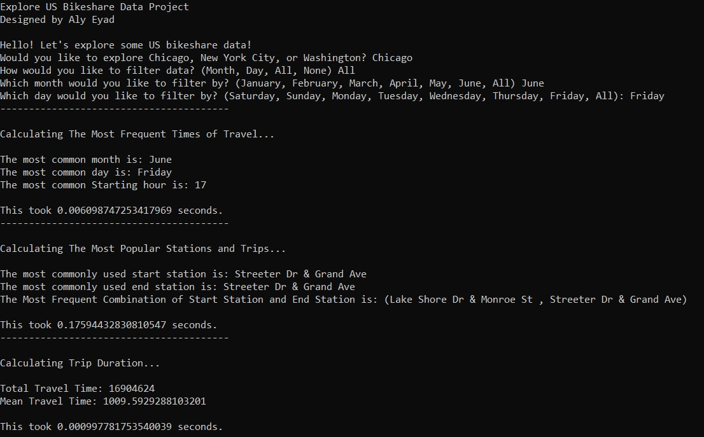
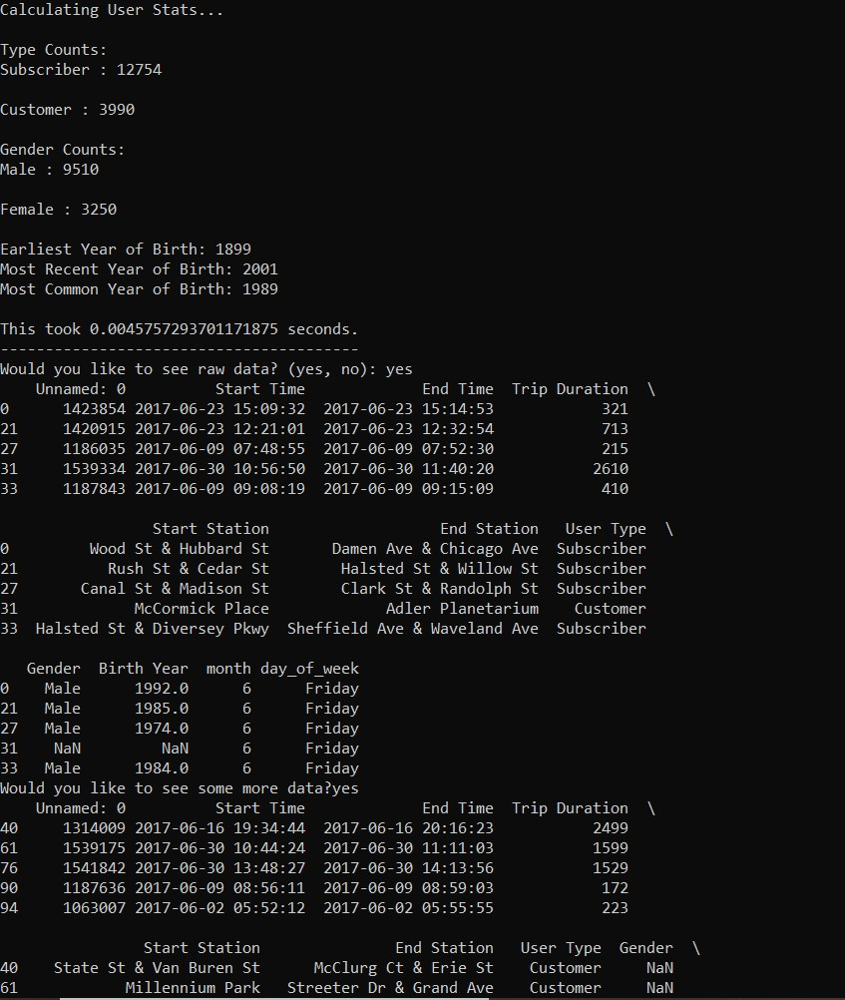

# Explore US Bikeshare Data Project

## Overview
In this project, you will make use of Python to explore data related to bike share systems for three major cities in the United States—Chicago, New York City, and Washington. You will write code to import the data and answer interesting questions about it by computing descriptive statistics. You will also write a script that takes in raw input to create an interactive experience in the terminal to present these statistics.

## Tools Used:

To complete this project, the following software requirements apply:

- You should have Python 3, NumPy, and pandas installed using Anaconda
- A text editor, like Sublime or Atom. 
- A terminal application (Terminal on Mac and Linux or Cygwin on Windows).

## Project Description:

A python program that used datasets provided by [Motivate](https://www.motivateco.com/), a bike share system provider for many major cities in the United States, to uncover bike share usage patterns across three large cities: **Chicago**, **New York City**, and **Washington, DC**.

## Program Features:

1. Prompts the User to Enter the Name of the city.
2. Asks the User to Filter by month, day, both, or none.
3. Calculates Important Statistics, such as:
   1. The Most Frequent Times of Travel
   2. The Most Popular Stations and Trips
   3. Total and Average Travel Times
   4. User Type Counts
4. Displays raw data to the User.

## Screenshots

